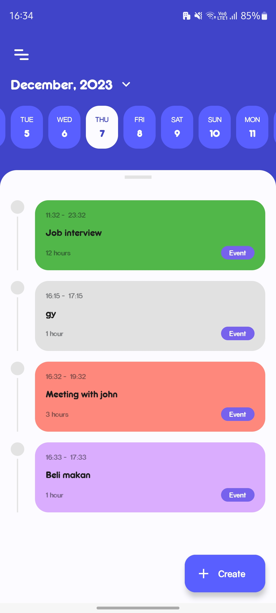
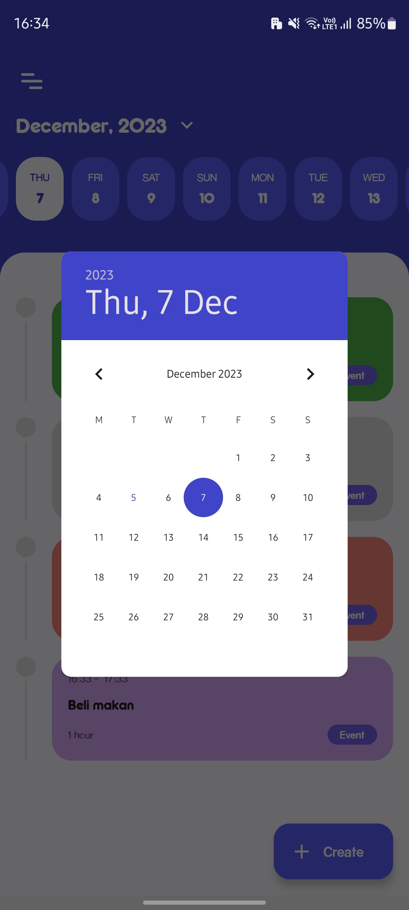
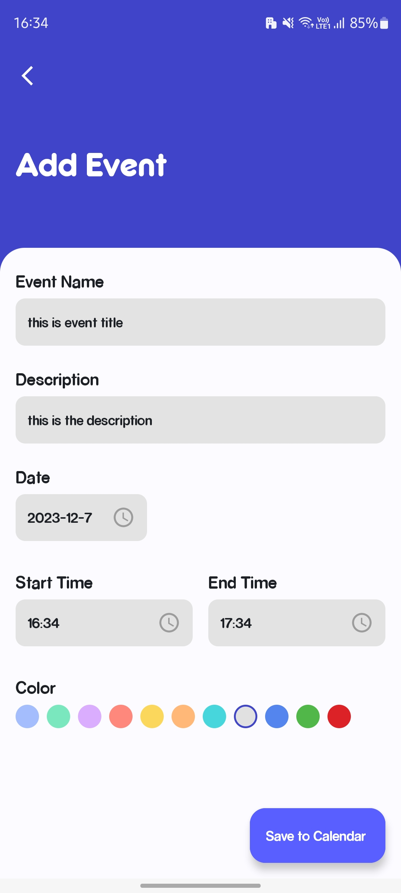
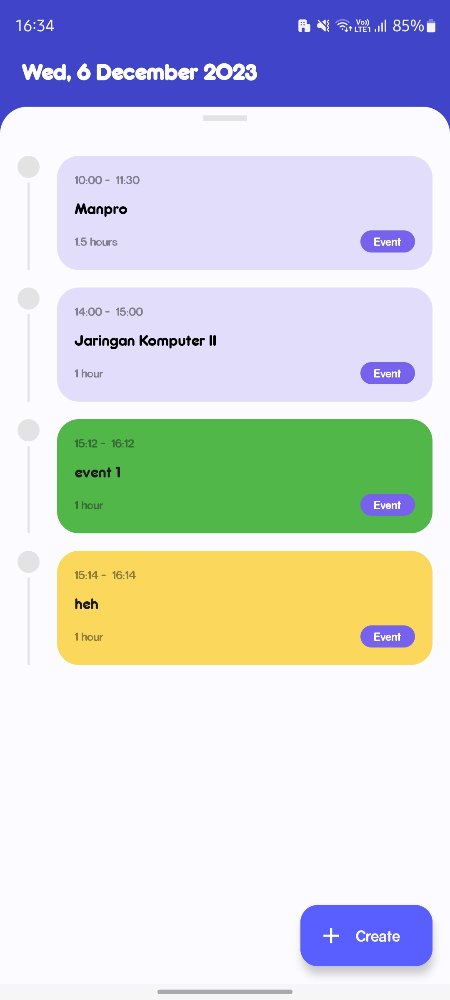

# Android Google Calendar Sync App

## Setup Instructions

### 1. Register the App with Google Calendar

#### a. Go to the Google Cloud Console

Visit [Google Cloud Console](https://console.cloud.google.com/) and create a new project.

#### b. Create a New Project

Name it something cool like "ProjectSyncItOrForgetIt."

#### c. Enable the Calendar API

Navigate to "APIs & Services" > "Library" and enable "Google Calendar API."

#### d. Create Credentials

Go to "APIs & Services" > "Credentials," create credentials, and choose "OAuth client ID." Select "Android" as the application type.

#### e. Configure OAuth Consent Screen

Configure OAuth consent screen with a name.

#### f. Configure the OAuth Client

Download your credentials as a JSON file, save it in the `app` module as `google-services.json`.

## Screenshots

  
  
  
  

# UI Credit
Credit for UI reference: https://id.pinterest.com/pin/823244006877374783/
